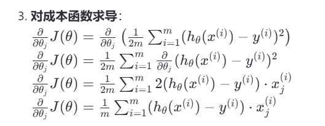

# 引子-线性回归
## 线性回归模型
线性回归模型是回归分析中最基础的模型，其基本形式为：
$$y=b+wx$$
以房价预测为例，$y$为房价，$x$为面积，$b$为截距，$w$为斜率。
如何确定$b$和$w$，让房价预测的误差尽可能小？
这个问题可以转化为求最小方差
$$min\sum_{i=1}^n(y_i-\hat{y_i})^2$$
$\hat{y_i}$为预测值，$y_i$为真实值。
其中$\hat{y_i}$可以通过$b$和$w$来确定，即$\hat{y_i}=b+wx_i$。
上面的最小方差公式可以转化为
$$min\sum_{i=1}^n(y_i-b-wx_i)^2$$
由于$x$和$y$都是已知的，所以求最小方差的问题可以转化为求$w$与$b$的值
将上面最小方差除以2n，得到下面的公式
$$J(w,b)=\frac{1}{2m}\sum_{i=1}^n(y_i-b-wx_i)^2$$
将$J(w,b)$对$w$称为成本函数。
* **代价函数（loss function）与成本函数（cost function）**
  
线性回归的代价函数是一个三维的图型，求三维图形的最低点即为最优解。
* 代价函数衡量的是单个训练样本的预测值与真实值之间的差异，用于评估模型在一个单一数据点上的表现。
* 成本函数是对整个训练集上所有样本的代价函数的平均值，或者是某种形式的聚合，用于评估模型在整个训练集上的整体表现。

成本函数计算过程

## 梯度下降法
梯度下降法是一种常用的求解最优解的方法，其基本思想是：
1. 初始化参数$w$和$b$，一般初始化为0。
2. 计算梯度，即求出$J(w,b)$关于$w$和$b$的偏导数。
3. 更新参数，即$w=w-\alpha\frac{\partial J}{\partial w}$，$b=b-\alpha\frac{\partial J}{\partial b}$。
其中，$\alpha$为学习率，用于控制步长。学习率通常是一个在0到1之间的数值，例如0.01。

上面计算$w$与$b$的更新值是同时进行的，计算过程如下：
首先计算$w$的更新值$tempw$ ,然后计算$b$的更新值$tempb$，最后，将$tmpw$赋值给$w$ ，将$tempb$赋值给$b$。
**总结1：**
梯度下降算法就是通过偏导数与学习率$alpha$来确定每次更新的参数，并将计算出来的参数运用在下一轮计算中

**线性回归在梯度下降的过程中只会有一个局部最优点，因为线性回归的成本函数是一个凸函数，所以一定能找到全局最优点，而如果成本函数不是凸函数，则不一定能找到全局最优点。**

### 批量梯度下降
* 批量梯度下降（Batch Gradient Descent）是一种常用的优化算法，用于最小化机器学习模型的成本函数。与随机梯度下降（Stochastic Gr adient Descent, SGD）和小批量梯度下降（Mini-Batch Gradient Descent）不同，批量梯度下降在每次迭代中使用整个训练集来更新模型参数，批量梯度下降收敛稳定，可利用矩阵进行高效的计算，在数据集很大时，计算成本较高。
* 小批量梯度下降（Mini-Batch Gradient Descent, MBGD） 每次使用一个固定数量的样本计算梯度并更新参数，损失函数对小批量样本求和或平均，然后计算梯度并更新权重 
* 随机梯度下降（Stochastic Gradient Descent, SGD） 每次仅用一个训练样本来计算梯度并更新权重，损失函数对单个样本求导，然后立即更新权重

## 学习率$\alpha$
* 如果学习率太小，会导致学习效率降低，计算成本变高
* 如果学习率过大，学习步长过大，可能会导致无法到达最优解，或者进入局部最优解。
* 当出现局部最小值时，梯度下降的步长会变得很小，会逐步衰减为0，最终到达局部最优点。为避免学习过程中一直处于局部最优点，可以采取一下措施：
1. 随机初始化：
多次运行梯度下降算法，每次使用不同的初始权重。这样可以增加找到全局最小值的机会。
2. 动量（Momentum）：
在梯度下降过程中加入动量项，可以帮助算法更快地穿越平坦区域，并有助于跳出浅的局部最小值。动量项通过累积过去梯度的方向，使得更新方向更加稳定。
3. 自适应学习率方法：
使用自适应学习率的方法，如Adam、Adagrad、RMSprop等，这些方法可以根据参数的历史梯度信息动态调整学习率，有助于避免局部最小值。
4. 学习率衰减：
随着训练的进行逐渐降低学习率，可以帮助模型在训练初期快速逃离局部最小值，而在后期更加精细地逼近最优解。
5. 正则化：
引入正则化项（如L1或L2正则化）可以帮助模型避免过拟合，同时也有助于减少陷入局部最小值的风险。
6. 增加模型复杂度：
有时候，增加模型的复杂度（例如添加更多层或节点）可以使损失函数的形状发生变化，从而减少局部最小值的存在。
7. 随机搜索和贝叶斯优化：
对于高维优化问题，可以使用随机搜索或贝叶斯优化等高级搜索策略来寻找更好的初始点或优化路径。
8. 遗传算法和其他进化算法：
这些算法通过模拟自然选择的过程，可以有效地探索搜索空间，避免陷入局部最小值。

